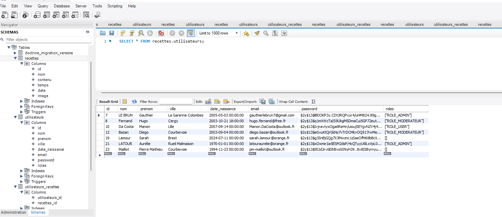
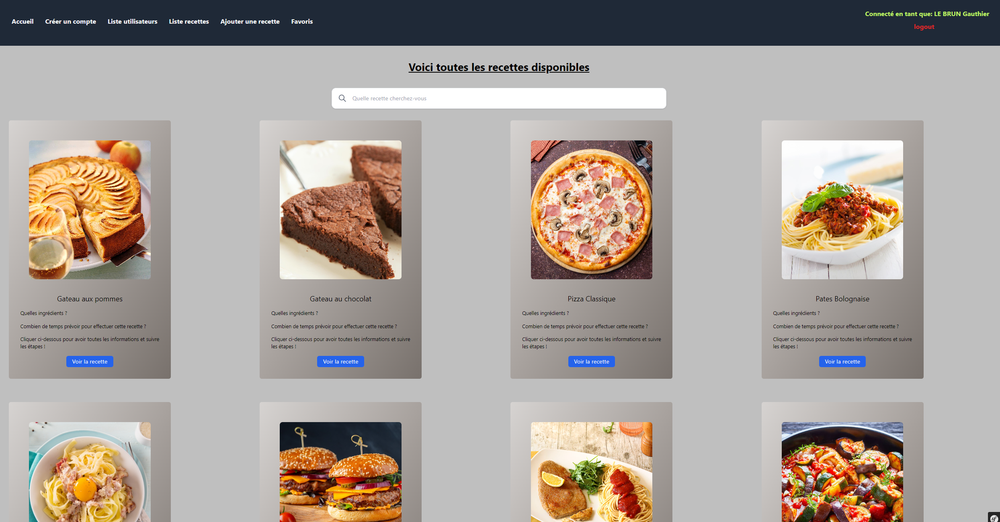
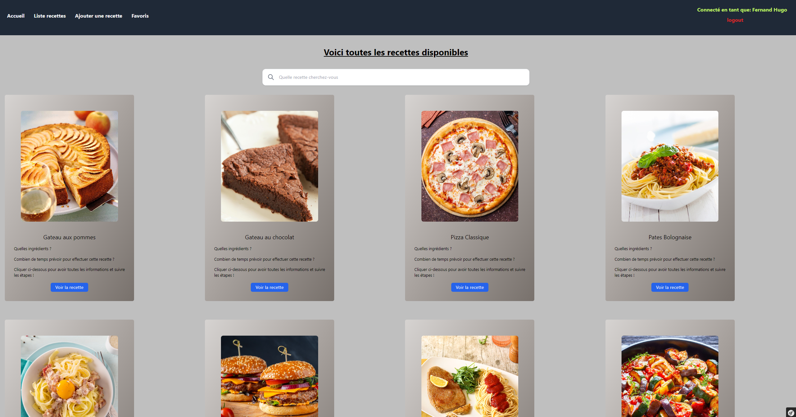
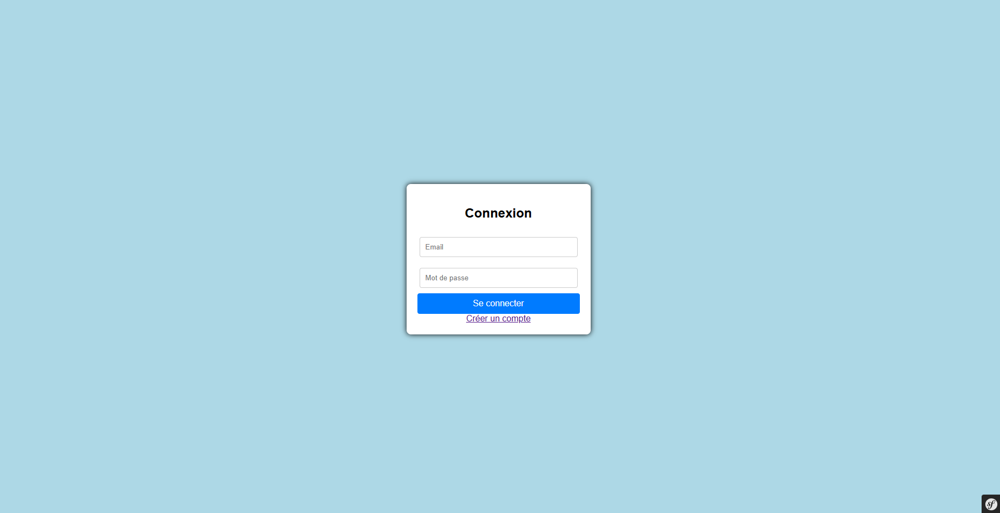
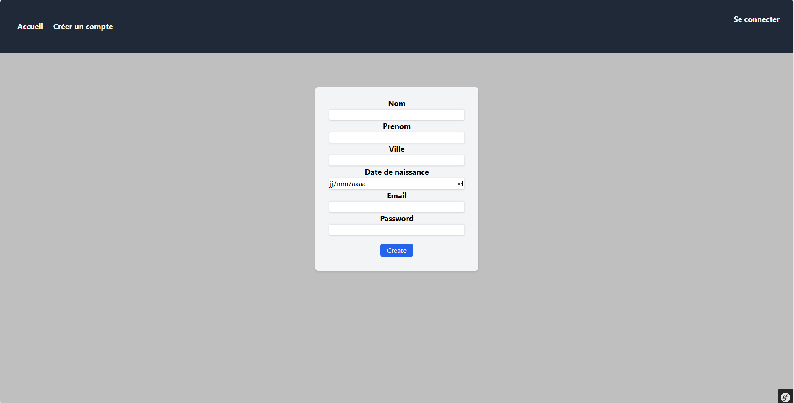
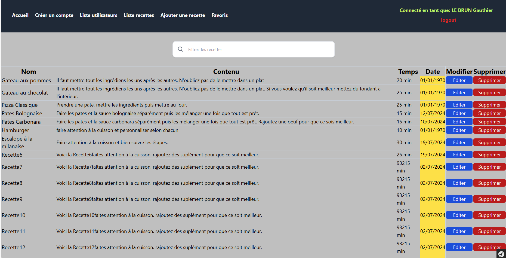
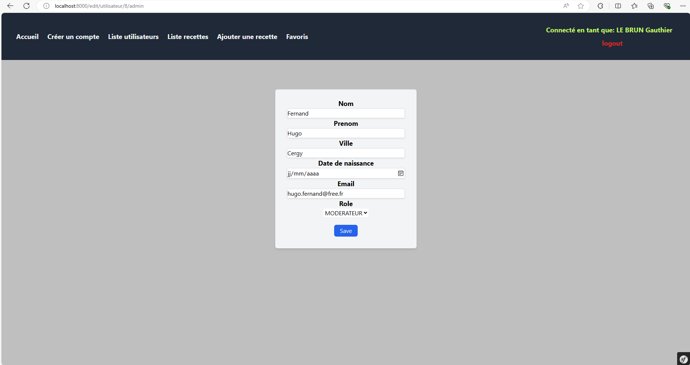
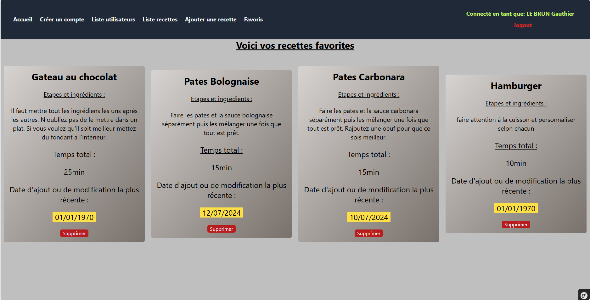

# Projet Marmiton – Stage CCO (Symfony)

Ce projet a été réalisé dans le cadre d’un stage au sein du CCO, avec pour objectif de me familiariser avec le framework Symfony à travers le développement d’un site web de recettes, inspiré du fonctionnement de *Marmiton*.

Le projet met en place une gestion des utilisateurs par rôles, une gestion des recettes, ainsi qu’une base de données relationnelle.


## Technologies utilisées

- PHP 8
- Symfony
- Twig
- Doctrine ORM
- MySQL
- HTML / CSS
- Git & GitHub


## Gestion des rôles

L’application repose sur plusieurs types d’utilisateurs :

- Visiteur (non connecté)
- Utilisateur connecté
- Modérateur
- Administrateur

Chaque rôle dispose de droits et fonctionnalités spécifiques.


## Fonctionnalités principales

### Visiteur (non connecté)
- Accès à la page d’accueil
- Consultation des recettes
- Création de compte
- Connexion

### Utilisateur connecté
- Accès aux recettes
- Ajout / suppression de recettes en favoris
- Gestion de son compte

### Modérateur
- Ajout de nouvelles recettes
- Gestion des recettes existantes

### Administrateur
- Gestion des utilisateurs (liste, modification)
- Gestion des modérateurs
- Accès à la liste complète des recettes
- Supervision globale de l’application


## Base de données

La base de données est gérée via Doctrine et comprend notamment :
- Utilisateurs
- Recettes
- Favoris
- Rôles

Schéma de la base de données :




## Captures d’écran

### Accueil
**Administrateur**


**Modérateur**


**Visiteur**


### Authentification
**Connexion**


**Création de compte**



### Recettes
**Ajout de recette (modérateur)**


**Liste des recettes (admin)**



### Utilisateurs
**Liste des utilisateurs (admin)**


**Édition d’un utilisateur (admin)**



### Favoris
**Gestion des favoris (utilisateur connecté)**



## 🚀 Installation du projet

```bash
git clone https://github.com/ton-compte/projet_marmiton_stage_CCO.git
cd projet_marmiton_stage_CCO
composer install
symfony serve
